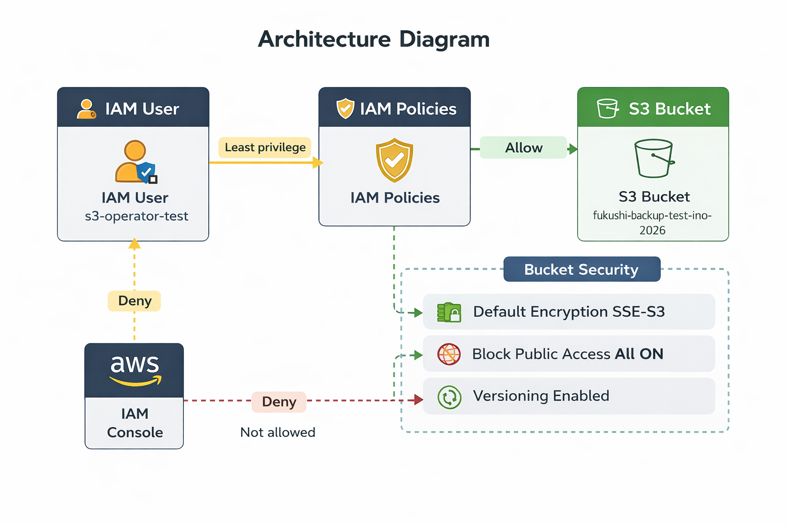

# AWS Serverless Notification System

## Overview
This project is a serverless notification system built using AWS services.

When a file is uploaded to Amazon S3, AWS Lambda is triggered automatically.
The Lambda function stores record data in Amazon DynamoDB and sends an email notification via Amazon SNS.

## Architecture


S3 → Lambda → DynamoDB → SNS → Email

## AWS Services Used

- Amazon S3
- AWS Lambda
- Amazon DynamoDB
- Amazon SNS
- Amazon CloudWatch
- IAM

## Features

- Detect file uploads in S3
- Trigger Lambda automatically
- Store data in DynamoDB
- Send email notifications via SNS
- Monitor logs using CloudWatch

## Project Flow

1. Upload a file to S3
2. Lambda is triggered automatically
3. The upload record is saved in DynamoDB
4. SNS sends an email notification
5. Logs can be checked in CloudWatch

## Learning Outcomes

Through this project, I learned:

- How to build a serverless architecture on AWS
- How to configure S3 event triggers
- How to integrate Lambda with DynamoDB and SNS
- How to troubleshoot using CloudWatch Logs

## Future Improvements

- Add API Gateway to build an API service
- Store uploaded file metadata
- Improve notification message content
- Add a simple frontend interface
## Lambda Function Code

The following Lambda function processes the S3 upload event,
stores the event record in DynamoDB, and sends a notification via SNS.

```python
import json
import boto3
import uuid
from datetime import datetime

dynamodb = boto3.resource('dynamodb')
table = dynamodb.Table('portfolio-table-tokyo')

sns = boto3.client('sns')

TOPIC_ARN = "YOUR_SNS_TOPIC_ARN"

def lambda_handler(event, context):
    record_id = str(uuid.uuid4())
    now = datetime.now().isoformat()

    table.put_item(
        Item={
            'id': record_id,
            'timestamp': now
        }
    )

    sns.publish(
        TopicArn=TOPIC_ARN,
        Message="A file has been uploaded to S3.",
        Subject="Portfolio Notification"
    )

    return {
        'statusCode': 200,
        'body': json.dumps('Success')
    }
```
## Architecture

```text
S3 (File Upload)
      │
      ▼
Lambda (Trigger / Process)
      │
      ├──► DynamoDB (Store Record)
      │
      ▼
SNS (Notification)
      │
      ▼
Email
```
